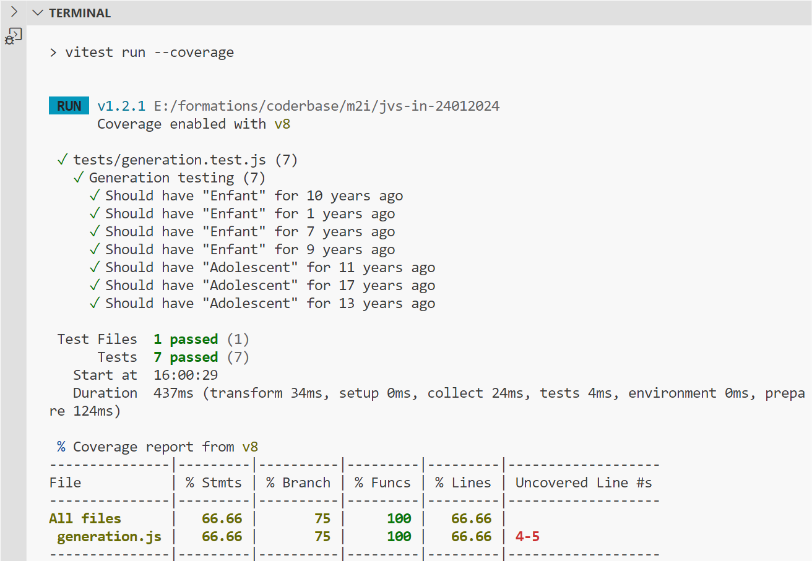

# Ressources pour préparer la certification PSD I

## Repartitions des questions (officiel depuis SCRUM.org)

- [Lien vers l'explication de la repartition des questions](https://www.scrum.org/assessments/professional-scrum-developer-certification)

PSD includes questions from the following Focus Areas as defined in the Professional Scrum Competencies. ***Approximately 85%*** of the questions will be selected randomly from the following Focus Areas.

Developing & Delivering Products Professionally:
- Backlog Refinement, Cross-functional, Self-managed Development, Design & Architecture, - Programming, Quality, Testing

Additionally, ***approximately 15%*** of the questions will be selected randomly from the Focus Areas listed below. These questions are designed to validate your knowledge around the core concepts of Scrum.

Understanding and Applying the Scrum Framework:
- Empiricism, Scrum Values, Scrum Team, Events, Artifacts, Done
Developing People and Teams:
- Self-Managing Teams, Facilitation, Coaching and Mentoring
Managing Products with Agility:
- Forecasting & Release Planning, Product Value, Product Backlog Management, Stakeholders & Customers

---

## Manifeste Agile avec les 4 valeurs et 12 principes

- [Manifeste Agile](https://manifesteagile.fr/)

---

## Glossaire SCRUM

- [PSD Glossaire](https://www.scrum.org/resources/professional-scrum-developer-glossary)
- [SCRUM Glossaire](https://www.scrum.org/resources/scrum-glossary)

---

## SCRUM GUIDE

- [SCRUM GUIDE 2020 en anglais version en ligne](https://scrumguides.org/scrum-guide.html)
- [SCRUM GUIDE 2020 en anglais version téléchargeable](https://scrumguides.org/docs/scrumguide/v2020/2020-Scrum-Guide-US.pdf)
- [SCRUM GUIDE 2020 en français version téléchargeable](https://scrumguides.org/docs/scrumguide/v2020/2020-Scrum-Guide-French.pdf)
- [Vidéos la minute Agile décryptage SCRUM GUIDE](https://www.youtube.com/watch?v=53Me6CvtSKM&list=PL9Q_Ei1JWJ4f5VcugVY84ipKEOfsPvphG&index=1)
- [Vidéos SCRUM Life sur le SCRUM GUIDE](https://www.youtube.com/watch?v=hFmswldixSs)
- [Audio SCRUM GUIDE 2020](https://www.youtube.com/watch?v=G8jE3pGfGZE&pp=ugMICgJmchABGAE%3D)

---

## QUIZ en live gratuit

- [Vidéo de Hey SCRUM sur la certification PSM I](https://www.youtube.com/watch?v=pAQeEu-l8ZM)
- [Vidéo de ExamsPM Préparation certifications PSM, CSM, ACP](https://www.youtube.com/watch?v=rXANXh7HBOE)
- [Vidéo DEVITZONE](https://www.youtube.com/watch?v=cfZ782rpUFo&list=PLpRUUMt8tyHWe3gtnS1XYh2EfrCVCtf2N)
- [Vidéo de Valentin Despa focus Live Questions & Answers](https://www.youtube.com/watch?v=IhMX6loPi8Q)
- **[QUIZ accessible via GITHUB mais vous avez les réponses directement](https://github.com/Ditectrev/Professional-Scrum-Developer-I-PSD-I-Practice-Tests-Exams-Questions-Answers)**
- [Echantillon Quiz PSD](https://capeprojectmanagement.com/psd-sample/quiz_html5.html)

---

## QUIZ officiel d'entrainement à l'examen par SCRUM.org

- [SCRUM](https://www.scrum.org/open-assessments/scrum-open)
- [PSD](https://www.scrum.org/open-assessments/scrum-developer-open)

---

## Warning

- Attention vous pouvez tomber sur les QCM de [Mikhail Lapshin](https://mlapshin.com/index.php/scrum-quizzes/) en faisant des recherches sur Web. Ses questions se basent sur l'ancienne version du SCRUM GUIDE 2017 donc elles ne sont pas à jour. Je vous déconseille pour le moment de faire les quiz car cela peut vous induire en erreur pour l'examen qui se base sur la version de SCRUM GUIDE 2020.

---

## Pour compléter le cours

- [Design Pattern](https://refactoring.guru/fr/design-patterns)
- [Mise en pratique différence BDD et ATDD](https://www.youtube.com/watch?v=aebv1z80vSM)
- [Extreme Quotation](https://blog.myagilepartner.fr/index.php/2017/04/19/extreme-quotation/)
- [Planning Poker](https://www.atlassian.com/blog/platform/scrum-poker-for-agile-projects)
- [SCRUM Cheat-sheets(aide mémoire)](https://cheatography.com/vini-vivero/cheat-sheets/scrum/)
- [Ebook sur les métriques à télécharger après avoir créé un compte sur le site](https://www.coursehero.com/file/169115232/codacy-ebook-metricspdf/)
- [Tests unitaires spy, stub et mock avec PHP](https://grafikart.fr/tutoriels/phpunit-test-unit-308)
- [Tests unitaires spy, stub et mock avec JavaScript (il date un peu mais les concepts restent les mêmes)](https://www.youtube.com/watch?v=dF_zUg7uCpA)
- [Principes SOLID en PHP](https://www.digitalocean.com/community/conceptual-articles/s-o-l-i-d-the-first-five-principles-of-object-oriented-design)
- [Principes SOLID en JavaScript](https://www.freecodecamp.org/news/solid-principles-for-programming-and-software-design/)

### Code coverage

### Exemple de Definition of Done

---

## Tips

- **LISEZ ET ECOUTEZ LE SCRUM GUIDE 2020 TOUS LES JOURS**
- [Les conseils de Pachai Devaraj](https://pachai-devaraj.medium.com/professional-scrum-master-i-cheat-sheet-tips-8906d51d3426)
**WARNING** : attention pour le point 6, Sprint Progress n'est pas un artefact de SCRUM. Les 3 Artefacts sont Product Backlog, Sprint BackLog et l'incrément.

---

## Thèmes des sujets de la certification

- Technical Practices
- Testing
- Quality
- Design & Architecture
- Cross-Functional, Self-Managed Development
- Backlog Refinement
- Cross-Functional, Self-Managing Teams
- Scrum Framework
- Scrum theory and Principles

---

## Hors certification

- [Différents contrats](https://fr.linkedin.com/pulse/contrats-agiles-le-casse-tete-chinois-eric-le-guillou)

### Injections SQL

[Source E. KAAS Harrys-phills](https://fr.linkedin.com/pulse/comprendre-les-diff%C3%A9rents-types-de-sql-injection-et-vos-ecoucou-kaas)

---

### Faille CSRF

#### Attaque

[Source leblogduhacker](https://www.leblogduhacker.fr/faille-csrf-explications-contre-mesures/)

#### Solution

[Source vaadata](https://www.vaadata.com/blog/)

