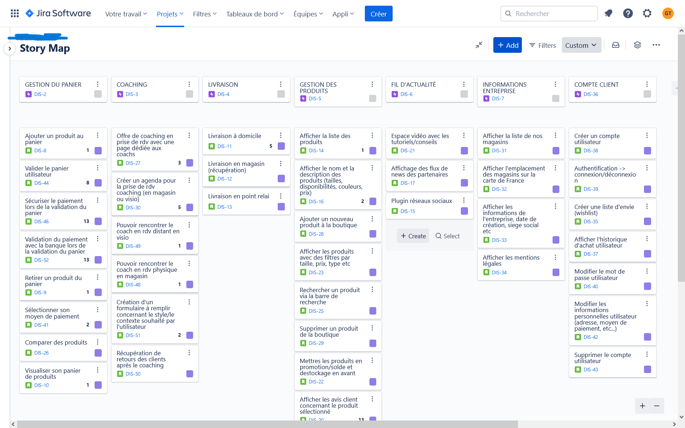
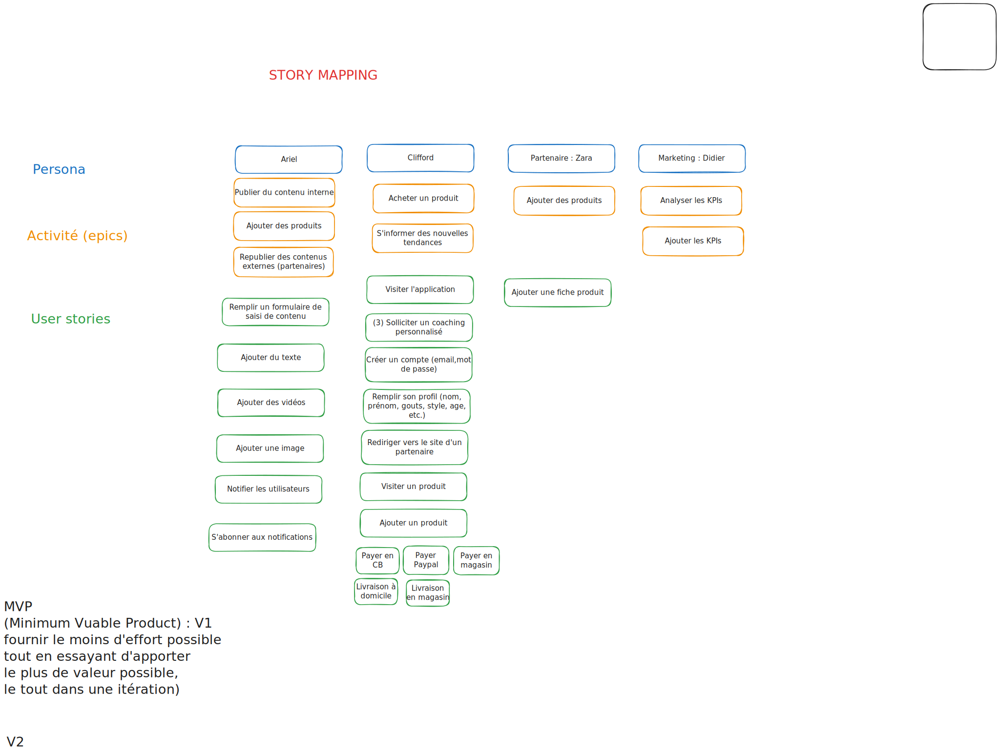
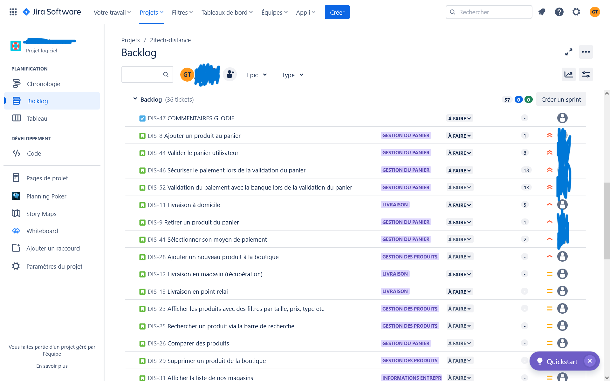
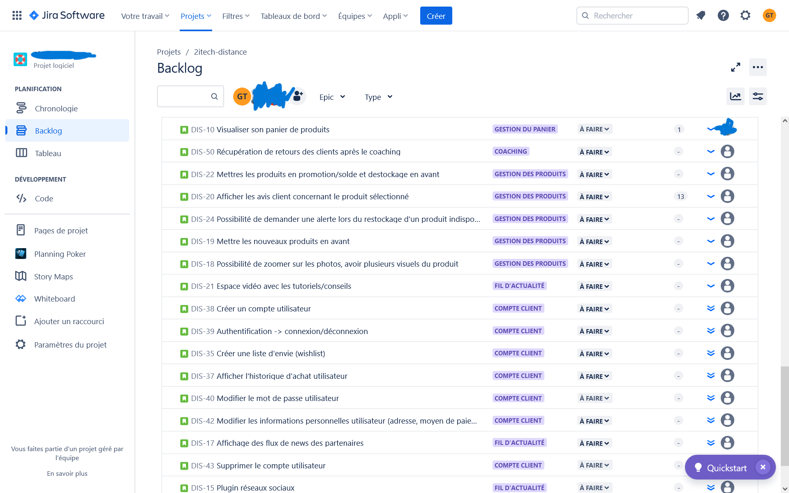
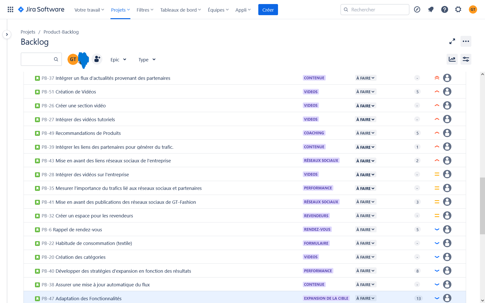
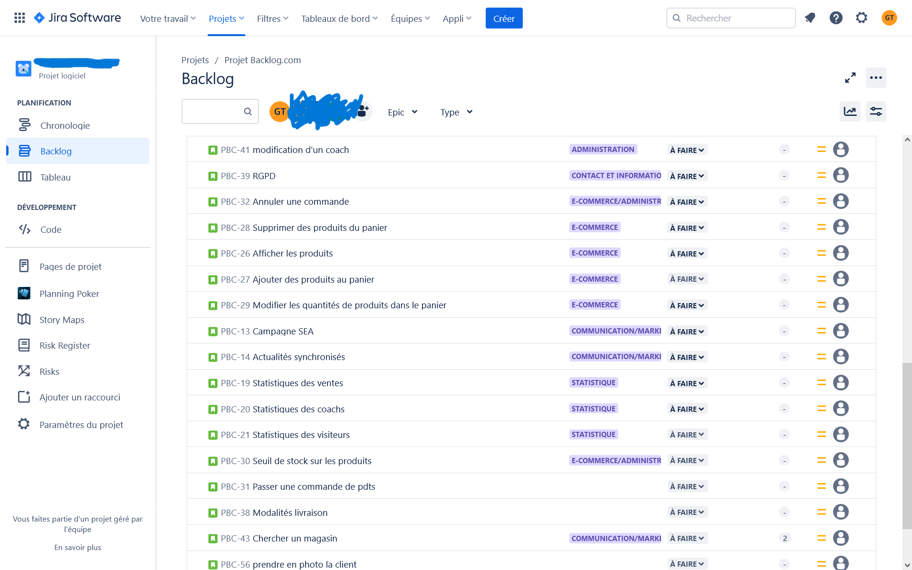
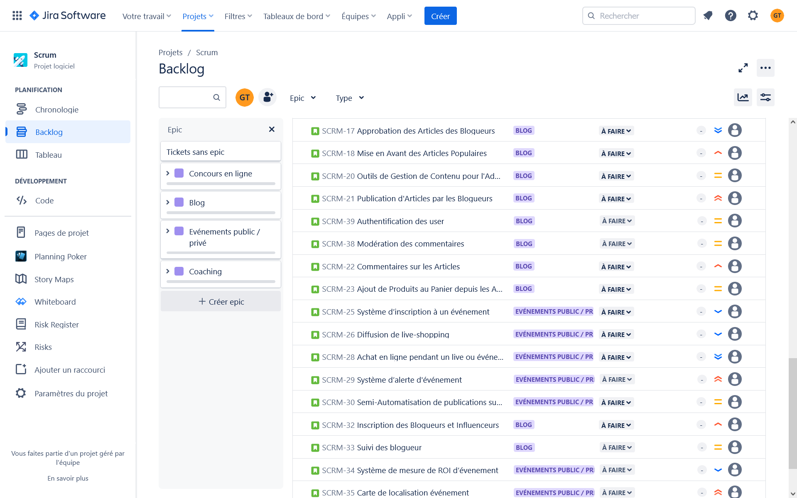
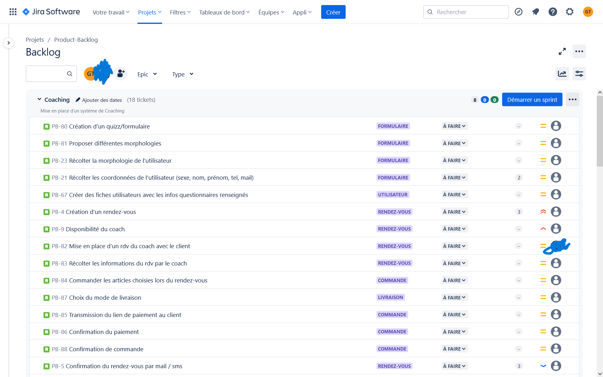
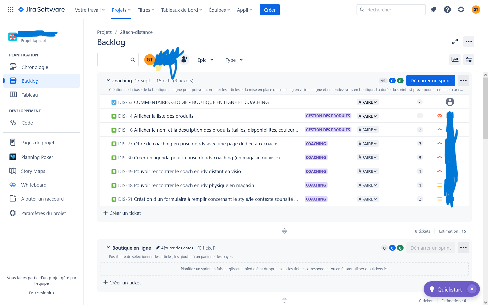

# Exemple Product Backlog travaux de plusieurs stagiaires

## Expression des besoins

L'entreprise GT-Fashion, jeune entreprise crée en 2020 dont le siège social se trouve à Paris, spécialisée dans la mode.

Elle possède quelques magasins physiques et des revendeurs un peu partout en France.

Elle n'est pas connue par le grand public, car son expertise était jusqu'à présent destiné aux professionnelles (B2B).

L'entreprise souhaite donc développer sa présence en proposant les dernières tendances vestimentaires pour les particuliers par le biais du coaching personnalisé (achat et association d'articles).

Elle cible uniquement les hommes pour le lancement. L'extension de la cible dépendra des retours et de l’évolution du CA engendré une fois qu'elle pourra exploiter la solution à développer.

GT-Fashion souhaite afficher des extraits des vidéos réalisées par ses équipes pour présenter l'entreprise et donner des conseils à travers des tutoriels réalisés par son équipe de communication.

L'entreprise utilise énormément les réseaux sociaux pour communiquer et publier des contenus visuels images ou vidéos. 
Elle aimerait intégrer partiellement les publications venant de ces derniers selon leurs pertinences dans la solution à développer.

Pour consolider ses relations avec ses partenaires et générer du trafic sur les sites de ses partenaires, l'enseigne veut intégrer un flux d'actualité des magazines, des blogueurs, des influenceurs avec qui elle travaille.

---

## Story maps

---

## Product BackLog (PB)

### Backlogs

---

### Sprints : objectif *Coaching*

