# Exemple d'un projet

---

## Extrait du *Product Backlog (PB)*

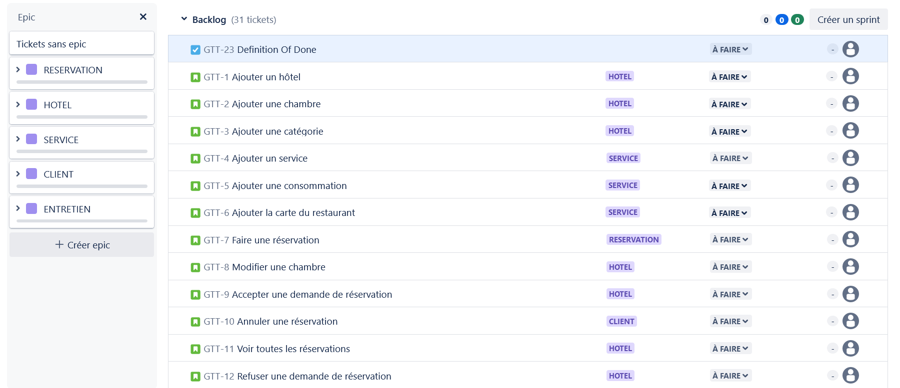

---

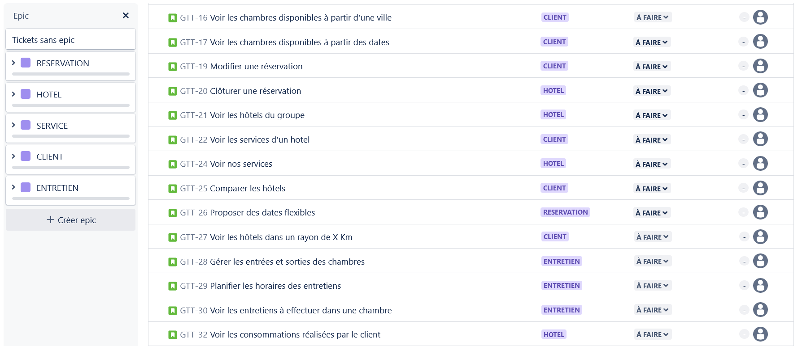

---

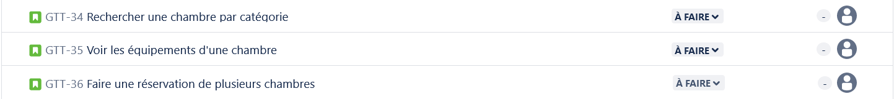

---

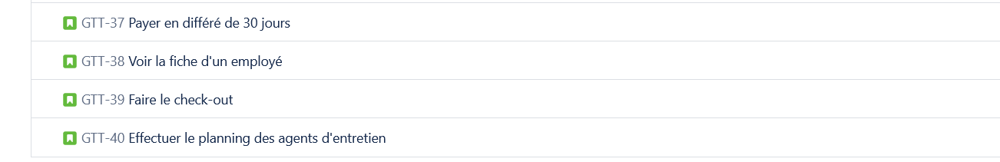

---

## Personas

L'équipe Marketing du client vous fournit les profils type des futurs utilisateurs.

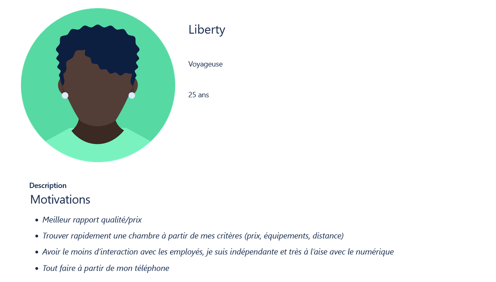

---

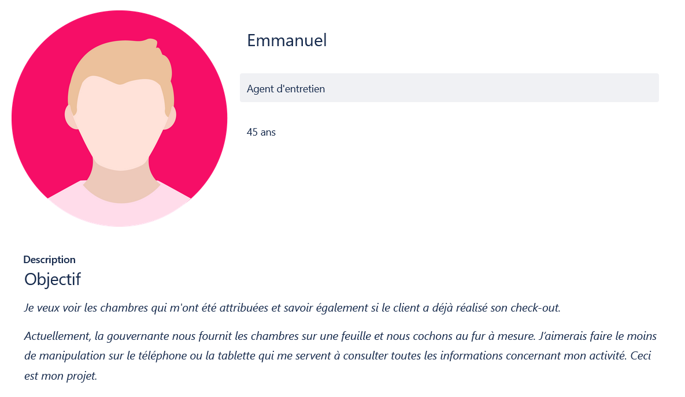

---

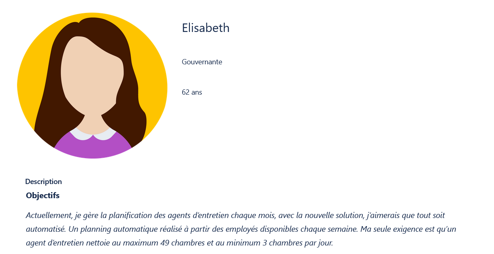

---

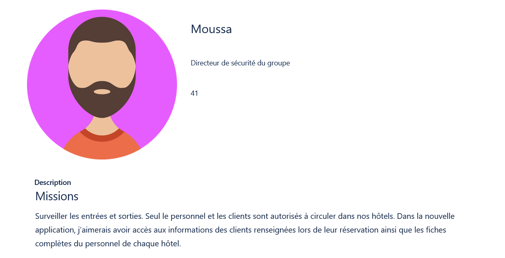

---

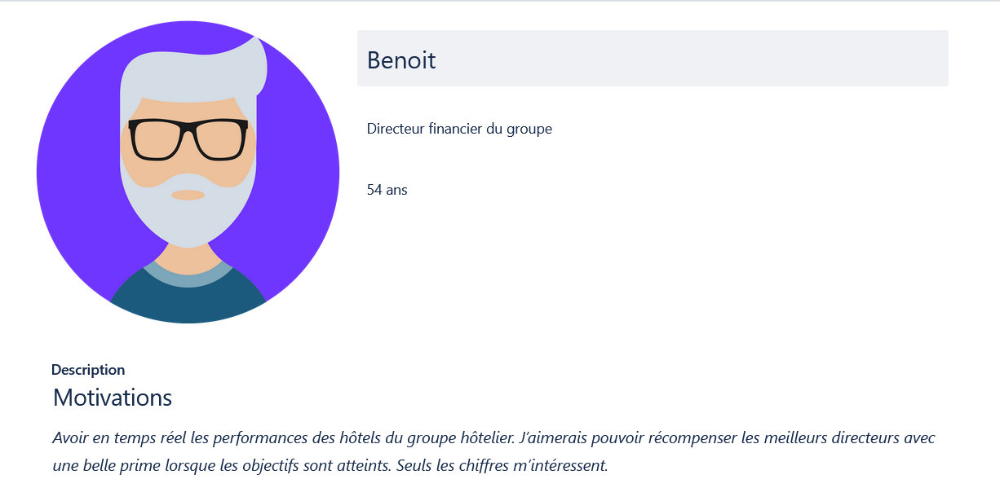

---

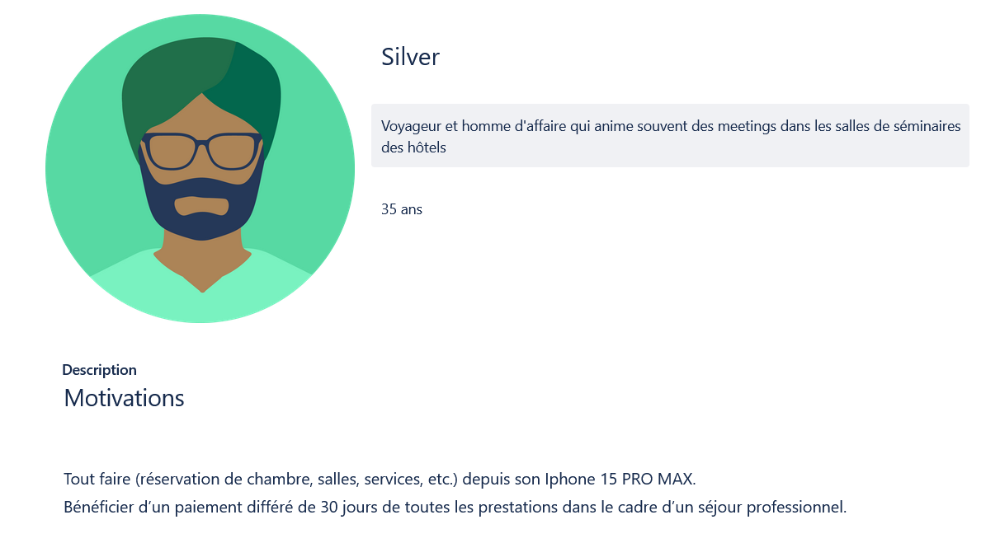

---

## Expression des besoins du groupe GTHôtel (anciennement GT Toît)

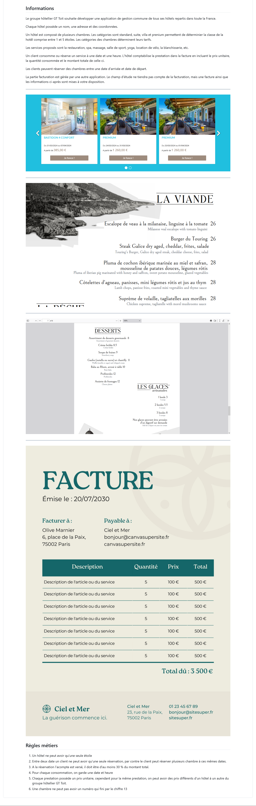

